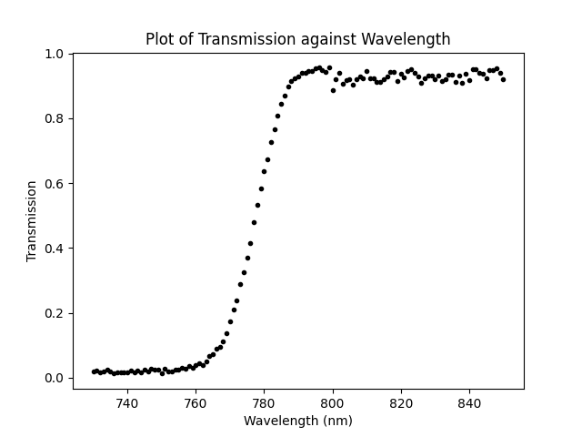

# ARIEL Calibration
This software is designed to carry out calibration calculations for transmission against wavelength.
It uses measured currents when a light source is passed through a filter, directly onto the detector and off. 

## How to use
run `main.py`

Follow the instructions on the screen to select the dark current, the filtered data and the unfiltered data.

Provided with this project are three sets of sample data `dark.txt`, `filtered.txt` and `unfiltered.txt`.

Additionally, a sample output of this software `transmission.csv` is also provided, as well as an example of the plots 
that can be generated with this system `sample_plot.png` as shown below.

